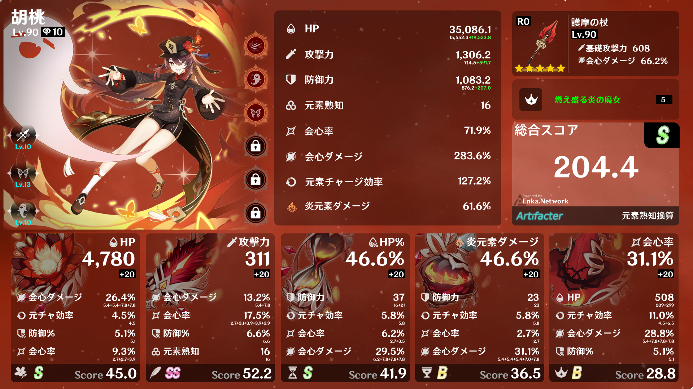

# Genshin-create-json

Genshin ArtifacterのGenerater.pyで使用されているdata.jsonを上書きし、新しいデータを導入して画像を生成します。このリポジトリのファイルは全てGenerater.pyと同じ階層に配置してください。
<div>2時間で書いたのでコード汚いです<br>
2023/11/21 16:07</div>

## 使用方法

1. Generater.pyの一部を削除します。以下のコードを削除してください。

   ```python
   # 559行
   Base.show()
   Base.save(f'{cwd}/Tests/Image.png')

   # 583行
   generation(read_json('data.json'))
   ```
2. 関数呼び出し
   ```python
   import json,os
   from main import dataSetup
   from Generater import generation,read_json
   
   if __name__ == "__main__":
     def update_json_file(file_path, new_data):
       if os.path.exists(file_path):
         try:
           with open(file_path, 'r', encoding='utf-8') as file:
             existing_data = json.load(file)
         except json.decoder.JSONDecodeError:
           existing_data = {}
       else:
         existing_data = {}
       existing_data.update(new_data)
       with open(file_path, 'w', encoding='utf-8') as file:
         json.dump(existing_data, file, ensure_ascii=False, indent=2)
   
     file_path = 'data.json'
     UID = 826487438
     result = dataSetup(UID=UID)
     update_json_file(file_path, result)
     generation(read_json('data.json'))
   ```


   


3. Generater.py 書き換え
```py
import requests,os

# generation関数

  UI: dict = CharacterData.get('UI_')
  avatarId : int = UI.get('avatarId')
  UI_Gacha : dict = UI.get('UI_Gacha')
  # Weaponの下に
  UI_weapon_Gacha : dict = Weapon.get("UI_weapon")

# キャラクター
    CharacterCostume = CharacterData.get('Costume')
    if CharacterName in ['蛍','空']:
        CharacterImage = Image.open(f'{cwd}/character/{CharacterName}({element})/avatar.png').convert("RGBA")
    else:
        try:
            if CharacterCostume:
                CharacterImage = Image.open(f'{cwd}/character/{CharacterName}/{CharacterCostume}.png').convert("RGBA")
            else:
                CharacterImage = Image.open(f'{cwd}/character/{CharacterName}/avatar.png').convert("RGBA")
        except FileNotFoundError:
            Gacha_url = f"https://enka.network/ui/{UI_Gacha}.png"
            if os.path.exists(f'{cwd}/character/{CharacterName}/{CharacterCostume}.png'):
                CharacterImage = Image.open(f'{cwd}/character/{CharacterName}/{CharacterCostume}.png').convert("RGBA")
            elif os.path.exists(f'{cwd}/character/{CharacterName}/avatar.png'):
                CharacterImage = Image.open(f'{cwd}/character/{CharacterName}/avatar.png').convert("RGBA")
            else:
                response = requests.get(Gacha_url)
                response.raise_for_status()
                janame = loc["ja"][f"{characters[str(avatarId)]['NameTextMapHash']}"]
                os.makedirs(f'{cwd}/character/{janame}', exist_ok=True)
                with open(f'{cwd}/character/{janame}/avatar.png', 'wb') as img_file:
                img_file.write(response.content)
                CharacterImage = Image.open(f'{cwd}/character/{janame}/avatar.png').convert("RGBA")

# 武器
    try:
        Weapon = Image.open(f'{cwd}/weapon/{WeaponName}.png').convert("RGBA").resize((128, 128))
    except FileNotFoundError:
        print(WeaponName,UI_weapon_Gacha)
        Gacha_weapon_url = f"https://enka.network/ui/{UI_weapon_Gacha}.png"
        try:
            res = requests.get(Gacha_weapon_url)
            res.raise_for_status()
            with open(f'{cwd}/weapon/{WeaponName}.png', 'wb') as f:
                f.write(res.content)
            Weapon = Image.open(f'{cwd}/weapon/{WeaponName}.png').convert("RGBA").resize((128, 128))
        except:
            Weapon = Image.open(f'{cwd}/weapon/アモスの弓.png').convert("RGBA").resize((128, 128))
# 聖遺物
    def artifact_path_check():
        for _,parts in enumerate(['flower', "wing", "clock", "cup", "crown"]):
            details = ArtifactsData.get(parts)
            img_path = f"{cwd}/Artifact/{details['type']}/{parts}.png"
            directory = os.path.dirname(img_path)
            if not os.path.exists(directory):
                os.makedirs(directory)
            if not os.path.exists(img_path):
                artifactID: dict = details.get("icon")
                print("id", artifactID)
                img_url = f'https://enka.network/ui/{artifactID}.png'
                res = requests.get(img_url)
                res.raise_for_status()
                with open(img_path, 'wb') as img_file:
                    img_file.write(res.content)
            if not details:
                continue
    artifact_path_check()
```
